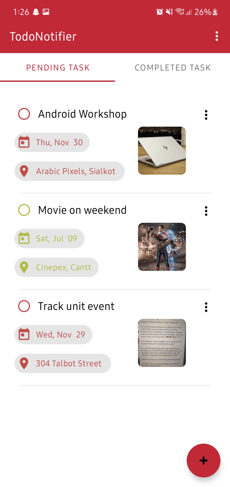
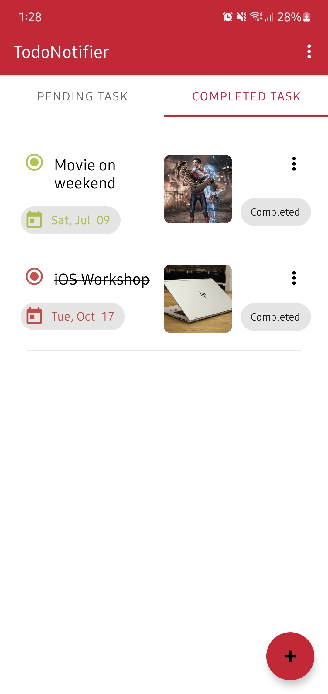
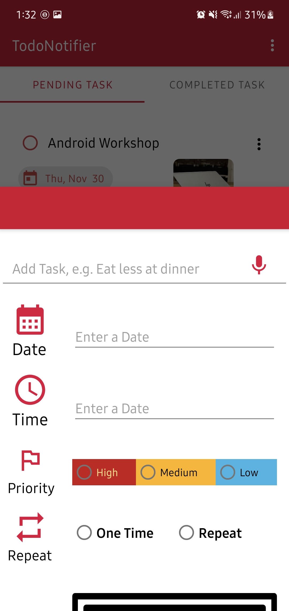

# TodoNotifier 📅📝

Welcome to TodoNotifier, your intelligent task manager for Android! 🚀

  

## Features

- **Task Management:** Utilizes Room Database to store tasks data, following the MVVM Architecture model for efficient data handling.

- **Notification Settings:** Allows users to set reminders for tasks with three priority modes.

- **Intelligent Notifications:** Notifies users on the specified date and time, considering priority settings.

- **Multimedia Integration:** Enables users to add pictures and locations to tasks for a more comprehensive view.

- **Flexible Frequency:** Customizable notification frequency - choose once or repeating (15 minutes, 30 minutes, hourly, daily, weekly, or monthly).

- **Task Status Update:** Easily mark pending tasks as done and re-add completed tasks if needed.

## Technologies Used

- **Java Programming Language:** Developed using Java for robust and efficient functionality.

- **MVVM Architecture:** Adheres to the MVVM Architecture model for organized and scalable development.

- **Room Database:** Utilizes Room Database to store and manage tasks data.

          

## Getting Started

To get started with TodoNotifier:

1. Clone this repository to your local machine.
2. Open the project in Android Studio.
3. Run the app on an emulator or a physical device.

## Usage

- Keep track of your tasks with ease.
- Set intelligent reminders with customizable settings.
- Enhance tasks with pictures and locations.
- Efficiently manage notifications with flexible frequency options.

## Contributing

Contributions are welcome! If you'd like to contribute, please follow these steps:

1. Fork this repository.
2. Create a new branch for your feature or bug fix.
3. Commit your changes and submit a pull request.

Empower your task management with TodoNotifier! 📅📝 #TodoNotifier #AndroidApp #Java #MVVM #RoomDatabase
